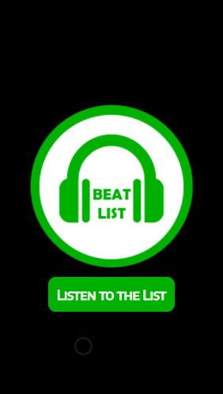

<h1 align="center"><strong>BeatList By Mateus Silva Folego   </strong></h1>

<h2><strong>Status:</strong> Finished ✔️</h2>

### In this project I developed BeatList, an interactive music playlist. With this program you can listen to the songs present in the list, fast forward the song, pause, go back, control the audio and some other things. Try out BeatList and feel the beats of the songs.

 

     
          
    

 

## **🚀 Technologies:**

 

 ✅ HTML

 ✅ CSS

 ✅ JAVASCRIPT

 

## 💻 Click on [BeatList](https://beatlist.netlify.app/), and feel the beats! 🎧🎶🎵

 

### Thanks for reading so far. if you want to contact me, feel free to send me a message or send a connection request on my [linkedIn](https://www.linkedin.com/in/mateus-silva-folego260601/) ❤!

 

<h2 align="center"> 📖 Always remember you`re <strong>NEVER</strong> alone!